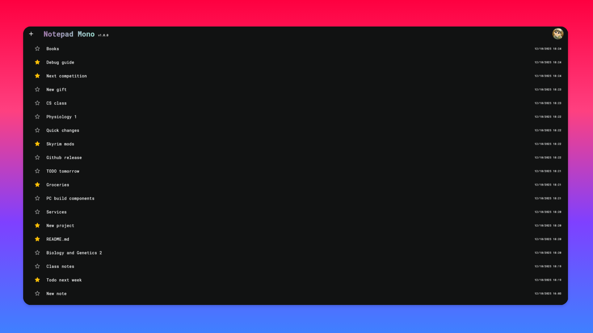
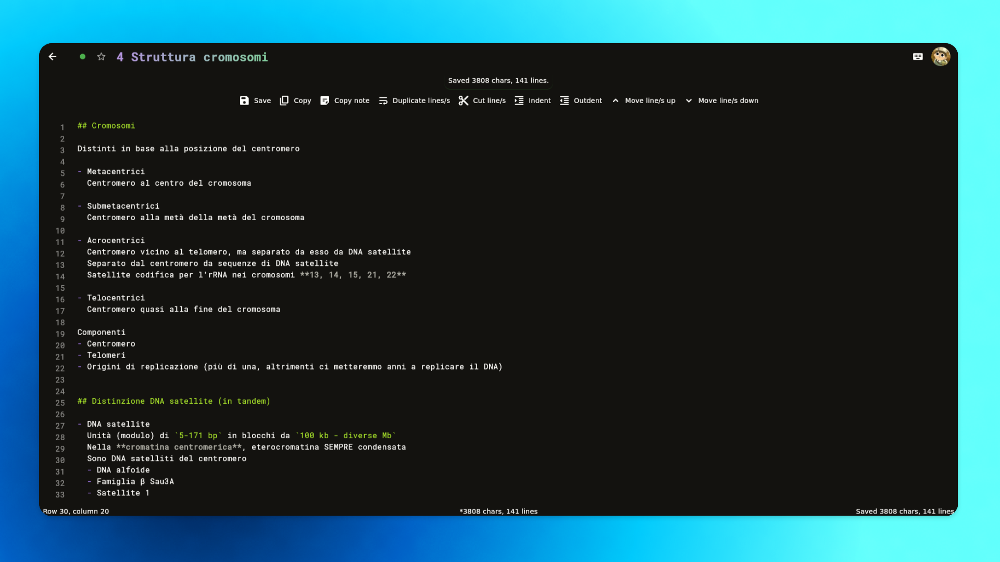
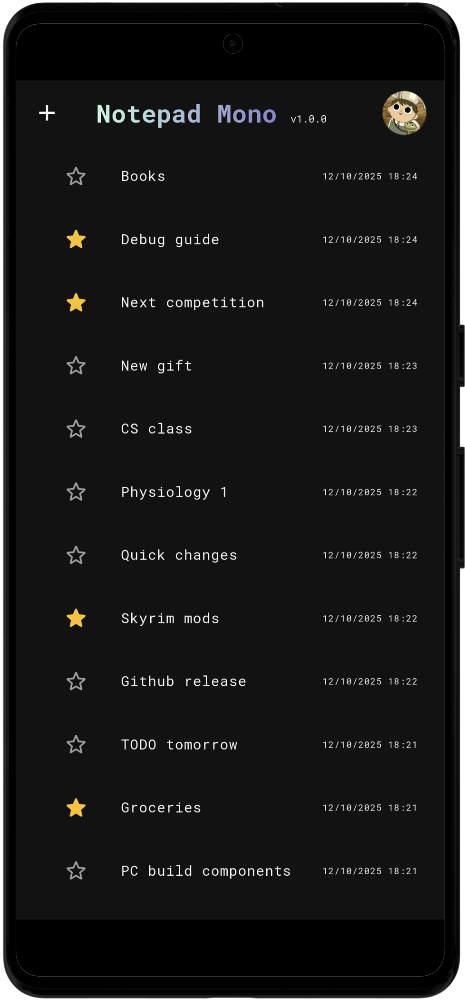
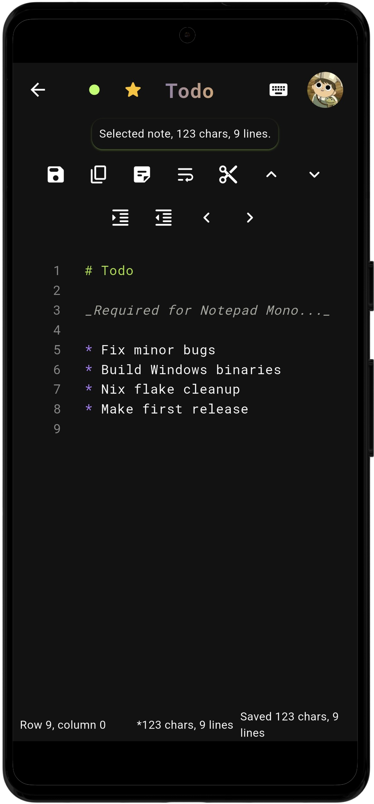

# Notepad Mono

[](https://github.com/MrSinho/notepad-mono/actions)
[](https://github.com/MrSinho/notepad-mono/actions)
[](https://github.com/MrSinho/notepad-mono/actions)


[](https://www.codefactor.io/repository/github/mrsinho/notepad-mono)

An open source app to write and sync your monospace notes everywhere.

<p align="center">

</p>

## Features

* Use a simple notepad with the same editing experience of an advanced text editor
* Cross platform with Windows, Linux and Android binaries
* Data syncronization across multiple devices using your Google, Github and Microsoft accounts
* Pretty UI and status bar

<p align="center">

</p>

## Release changelog

You can find the release changelog file [here](./CHANGELOG.md).

## Clone repository

```bash
git clone https://github.com/mrsinho/notepad-mono.git
```

## Easy flutter build

### 

```shell
cd app
flutter build linux --release
```

### 

```shell
cd app
flutter build windows --release
```


## Build from source with Nix flake

The Nix flake will download the required packages, compile and patch the Linux and Android binaries. Since application relies on external packages from [pub.dev](https://pub.dev) you must disable the `sandbox` option.

If you don't have installed nix on your system, you can follow the [official guide](https://nixos.org/download) for all platforms.

###  

```shell
mkdir -p nix/out/linux
nix build --option sandbox false --verbose ./nix/linux --out-link ./nix/out/linux/result
./nix/out/linux/result/NotepadMono
```

> [!NOTE]
> If you are running the application on NixOS, be sure you have enabled the **UDP port 3000**.

```nix
networking.firewall = {
  enable = true;
  allowedTCPPorts = [
    # [...]
  ];
  allowedUDPPorts = [
    # [...]
    3000
  ];
};
```

### 

```shell
mkdir -p nix/out/android
nix build --option sandbox false --verbose ./nix/android --out-link ./nix/out/android/result
```

For some reason during the build Gradle might fail/crash unexpectectly, and this might happen also in the Github actions job. For now rerunning the flake build will solve the issue. 

### Update flake locks (devs only)

<p align="center">


</p>

```shell
cd nix/linux
nix flake update
```

## Check Android Manifest in the .apk file

```bash
# Starting from repo root directory, after nix build
cd result/android
aapt dump xmltree notepad_mono.apk AndroidManifest.xml
```

## Android diagnostic

- Enable the developer options on your Android device
- Enable USB debug in the developer options
- Connect the device to a USB data port with a USB data cable
- From the terminal with the [Android Debug Bridge (adb)](https://developer.android.com/tools/adb) installed these commands might be useful.

```bash
# Check devices
adb devices

# Find package relative to the newly installed app
adb shell pm list packages | grep notepad_mono

# Send redirect action
adb shell am start -a android.intent.action.VIEW -d "notepad-mono://login-callback"
```

## Start dummy session

For testing purposes, if you do not want to create a new account you can have access to all the application features using a special URI:

* On desktop devices:

```bash
curl http://localhost:4516//dummy/?key=WQBjbIwEEpxhqCPhxwEFIAivcFdlCXpa
```

* On Android:

```bash
# From any browser or API client you can enter this link: notepad-mono://dummy/?key=WQBjbIwEEpxhqCPhxwEFIAivcFdlCXpa

# Or using the Android Debug Bridge (only debug builds)
adb shell am start -a android.intent.action.VIEW -d "notepad-mono://dummy/?key=WQBjbIwEEpxhqCPhxwEFIAivcFdlCXpa"
```

This `key` parameter corresponds to an environment variable which is read during the compilation of the application.

This "dummy" session is temporary but unlocks all the application features including note creation and editing.

## External packages

All the external packages are pulled from [pub.dev](https://pub.dev) listed with their relative version in the [pubspec.yaml].

## Data hosting and transparency

Currently the notes and databases are hosted by [Supabase](https://https://supabase.com/). While the database is encrypted and has RLS enabled, there is not E2E encryption enabled. admin devs could theoretically have access to the notes content. For safety reasons it's highly recommended to NOT save sensitive data such as passwords and personal information.

For more information about the privacy policy see the [related page](https://github.com/MrSinho/notepad-mono/blob/main/PRIVACY_POLICY.md).

## License

This project is licensed under the [**GNU General Public License v3.0**](https://github.com/MrSinho/notepad-mono/blob/main/LICENSE)

