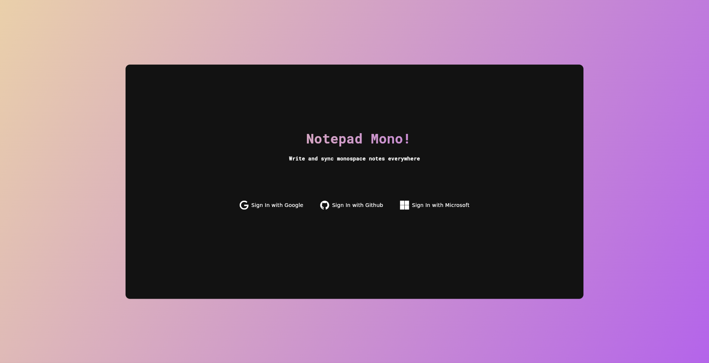

# Notepad Mono

An open source app to write and sync your monospace notes everywhere.

## Features

* Vanilla and Monaco code editors for writing notes with the same experience of an IDE
* Cross platform with Windows, Linux and Android binaries
* Data syncronization across multiple devices using your Google, Github and Microsoft accounts
* Pretty UI and status bar




## Clone repository

```bash
git clone https://github.com/mrsinho/notepad-mono.git
```

## Build Nix flake for reproducibility


The Nix flake will download the required packages, build and patch the Linux and Android binaries. Since application relies on external packages from [pub.dev](https://pub.dev) you must disable the `sandbox` option.


```shell
flutter clean
nix build --option sandbox false --verbose
./result/linux/notepad_mono
```

> [!NOTE]
> If you are running the application on NixOS, be sure you have enabled the **UDP port 3000**.

```nix
networking.firewall = {
  enable = true;
  allowedTCPPorts = [
    # [...]
  ];
  allowedUDPPorts = [
    # [...]
    3000
  ];
};
```

## Check Android Manifest in the .apk file

```bash
# Starting from repo root directory, after nix build
cd result/android
aapt dump xmltree notepad_mono.apk AndroidManifest.xml
```

## Android diagnostic

- Enable the developer options on your Android device
- Enable USB debug in the developer options
- Connect the device to a USB data port with a USB data cable
- From the terminal with the [Android Debug Bridge (adb)](https://developer.android.com/tools/adb) installed these commands might be useful.

```bash
# Check devices
adb devices

# Find package relative to the newly installed app
adb shell pm list packages | grep notepad_mono

# Send redirect action
adb shell am start -a android.intent.action.VIEW -d "notepad-mono://login-callback"
```

## Data hosting and transparency

Currently the notes and databases are hosted by [Supabase](https://https://supabase.com/). While the database is encrypted and has RLS enabled, admin devs can still theoretically have access to the notes content. For safety reasons it's highly recommended to NOT save sensitive data such as passwords and personal information.

## License

This project is licensed under the [**GNU General Public License v3.0**](https://github.com/MrSinho/notepad-mono/blob/main/LICENSE)
